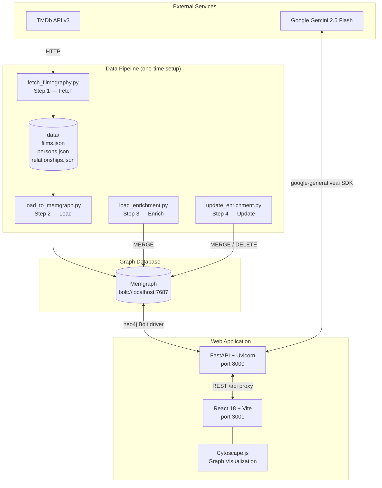
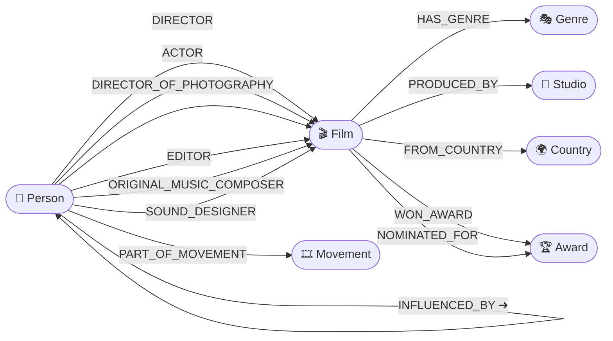
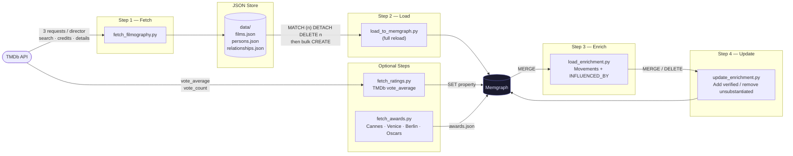
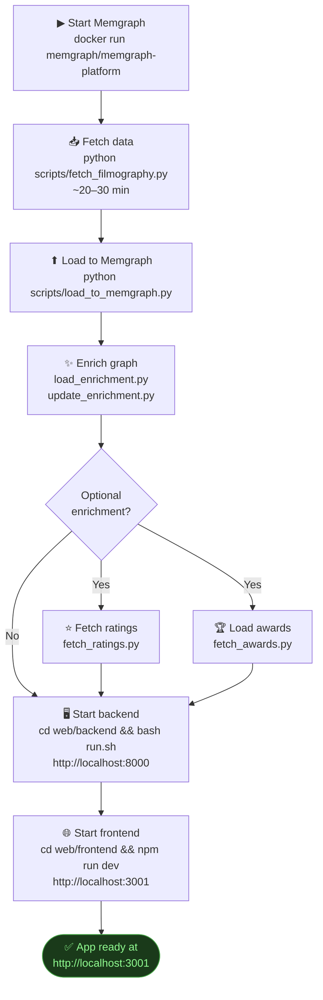

# CinematograpAI

> A cinema analysis system that models the filmographies, casts, cinematic movements, and influence relationships of 14 master directors in a graph database — explorable via natural language queries.

---

## Table of Contents

1. [Project Architecture](#1-project-architecture)
2. [Graph Schema](#2-graph-schema)
3. [Data Pipeline](#3-data-pipeline)
4. [Setup](#4-setup)
5. [Running the Project from Scratch](#5-running-the-project-from-scratch)
6. [Web Application](#6-web-application)
7. [API Reference](#7-api-reference)
8. [Memgraph Cypher Rules](#8-memgraph-cypher-rules)
9. [Example Queries](#9-example-queries)
10. [Graph Algorithms](#10-graph-algorithms)
11. [Project Structure](#11-project-structure)
12. [Known Issues and Solutions](#12-known-issues-and-solutions)

---

## 1. Project Architecture



**Technology Stack**

| Layer | Technology |
|---|---|
| Graph DB | Memgraph (Bolt protocol, port 7687) |
| Data source | TMDb API v3 |
| AI / NLP | Google Gemini 2.5 Flash (`google-generativeai`) |
| Backend | FastAPI + Uvicorn (Python 3.10+) |
| Frontend | React 18 + Vite + Tailwind CSS |
| Graph visualization | Cytoscape.js + react-cytoscapejs |
| DB driver | neo4j Python driver (Memgraph compatible) |

---

## 2. Graph Schema

### Schema Diagram



> **INFLUENCED_BY direction:** The arrow points *toward the influencing person*.
> Example: `(Nuri Bilge Ceylan)-[:INFLUENCED_BY]->(Andrei Tarkovsky)`

### Node Types

| Label | Description | Properties |
|---|---|---|
| `Person` | Directors, actors, DPs, composers, editors, sound designers + literary influences | `tmdb_id` (int), `name` (string) |
| `Film` | Films by seed directors | `tmdb_id` (int), `title` (string), `year` (int), `runtime` (int), `rating` (float), `vote_count` (int) |
| `Genre` | Film genres | `name` (string) |
| `Studio` | Production companies | `name` (string) |
| `Country` | Countries of production | `name` (string) |
| `Movement` | Cinematic movements and periods | `name` (string) |
| `Award` | Festival awards | `name` (string), `festival` (string) |

### Relationship Types

| Relationship | Direction | Count |
|---|---|---|
| `ACTOR` | (Person)→(Film) | 3,141 |
| `DIRECTOR` | (Person)→(Film) | 436 |
| `DIRECTOR_OF_PHOTOGRAPHY` | (Person)→(Film) | 411 |
| `EDITOR` | (Person)→(Film) | 380 |
| `ORIGINAL_MUSIC_COMPOSER` | (Person)→(Film) | 241 |
| `SOUND_DESIGNER` | (Person)→(Film) | 92 |
| `HAS_GENRE` | (Film)→(Genre) | 684 |
| `PRODUCED_BY` | (Film)→(Studio) | 689 |
| `FROM_COUNTRY` | (Film)→(Country) | 439 |
| `PART_OF_MOVEMENT` | (Person)→(Movement) | 34 |
| `INFLUENCED_BY` | (Person)→(Person) | 32 |
| `WON_AWARD` | (Film)→(Award) | — |
| `NOMINATED_FOR` | (Film)→(Award) | — |

### Total Graph Size

- **~9,900 nodes** (Person: ~6,195, Film: ~692, Studio: ~900, Country: ~50, Genre: ~20, Movement: 24, Award: ~50)
- **~10,000+ relationships**

### Seed Directors (34)

Andrei Tarkovsky, Stanley Kubrick, Ingmar Bergman, Woody Allen, Alfred Hitchcock,
Federico Fellini, Akira Kurosawa, Jean Renoir, David Fincher, Quentin Tarantino,
Paul Thomas Anderson, Nuri Bilge Ceylan, Zeki Demirkubuz, David Lynch,
Jean-Luc Godard, François Truffaut, Michelangelo Antonioni, Krzysztof Kieślowski,
Lars von Trier, Michael Haneke, Wim Wenders, Pedro Almodóvar, Wong Kar-wai,
Yasujirō Ozu, Abbas Kiarostami, Park Chan-wook, Bong Joon-ho, Hirokazu Kore-eda,
Martin Scorsese, Joel Coen, Terrence Malick, Spike Lee, Yılmaz Güney, Semih Kaplanoğlu

---

## 3. Data Pipeline



### Step 1 — Fetching Data from TMDb (`fetch_filmography.py`)

Three types of requests are made to the TMDb API for each seed director:

```
GET /search/person?query={name}                     → director TMDb ID
GET /person/{id}/movie_credits                      → filmography list
GET /movie/{id}?append_to_response=credits          → film details + crew + cast
```

**Filters:**
- `runtime >= 60` min (feature films only)
- `vote_count >= 20` (sufficient votes)
- Crew: Director, Director of Photography, Original Music Composer, Sound Designer, Editor
- Cast: first 10 actors (`ORDER BY order`)

The script merges with existing data — safe to re-run.

```bash
# All seed directors
python scripts/fetch_filmography.py

# Specific directors only (merges with existing data)
python scripts/fetch_filmography.py --only "Ingmar Bergman" "David Lynch"
```

### Step 2 — Loading to Memgraph (`load_to_memgraph.py`)

Clears the entire DB and reloads from JSON files:

1. Deletes all nodes and relationships (`MATCH (n) DETACH DELETE n`)
2. Creates Film nodes
3. Creates Person nodes
4. MERGEs Genre / Studio / Country nodes and links them to films
5. Creates Person–Film relationships
6. Applies cleanup: removes music video compilations, merges duplicate nodes, tags anthology films

```bash
python scripts/load_to_memgraph.py
```

### Step 3 — Enrichment (`load_enrichment.py`)

Adds external Person nodes not in TMDb, cinematic movements, and INFLUENCED_BY relationships.

**Added movements:** Soviet Poetic Cinema, New Hollywood, Scandinavian Art Cinema, Italian Neorealism, Italian Art Cinema, Japanese Golden Age Cinema, French Poetic Realism, Post-Classical Hollywood, Post-Modern Cinema, New Turkish Cinema, Surrealist Cinema, Classical Hollywood, British Cinema, and more.

```bash
python scripts/load_enrichment.py
```

### Step 4 — Update (`update_enrichment.py`)

Adds relationships found through source research; removes relationships lacking documented evidence.

```bash
python scripts/update_enrichment.py
```

---

## 4. Setup

### Requirements

- Python 3.10+
- Node.js 18+
- Memgraph Community Edition (Docker recommended)
- TMDb API key — [https://www.themoviedb.org/settings/api](https://www.themoviedb.org/settings/api)
- Google Gemini API key — [https://aistudio.google.com/app/apikey](https://aistudio.google.com/app/apikey)

> **Gemini model note:** This project uses `gemini-2.5-flash`. The free tier quotas for
> `gemini-2.0-flash-lite` and `gemini-2.0-flash` were exhausted during development —
> do not use these models.

### Memgraph Setup (Docker)

```bash
docker run -d --name memgraph-platform \
  -p 7687:7687 -p 3000:3000 \
  -v mg_data:/var/lib/memgraph \
  memgraph/memgraph-platform
```

Access Memgraph Lab at `http://localhost:3000`.
Bolt connection: `bolt://localhost:7687` (no auth required)

### Python Environment

```bash
cd web/backend
python -m venv .venv
source .venv/bin/activate        # Windows: .venv\Scripts\activate
pip install -r requirements.txt
```

`requirements.txt`:
```
fastapi==0.115.0
uvicorn[standard]==0.30.0
neo4j==5.25.0
google-generativeai==0.8.0
pydantic==2.9.0
python-dotenv==1.0.1
```

For data fetching scripts (project root):
```bash
pip install requests python-dotenv
```

### Frontend Dependencies

```bash
cd web/frontend
npm install
```

### Environment Variables

Create `web/backend/.env`:

```env
MEMGRAPH_URI=bolt://localhost:7687
TMDB_API_KEY=<your_tmdb_api_key>
GEMINI_API_KEY=<your_gemini_api_key>
```

---

## 5. Running the Project from Scratch



### Commands

```bash
# 1. Start Memgraph
docker run -d --name memgraph-platform \
  -p 7687:7687 -p 3000:3000 memgraph/memgraph-platform

# 2. Fetch data (~20–30 min)
python scripts/fetch_filmography.py

# 3. Load to Memgraph
python scripts/load_to_memgraph.py

# 4. Enrich
python scripts/load_enrichment.py
python scripts/update_enrichment.py

# 5. Start backend
cd web/backend && source .venv/bin/activate && bash run.sh

# 6. Start frontend (separate terminal)
cd web/frontend && npm run dev
```

---

## 6. Web Application

### Key Features

| Feature | Description |
|---|---|
| Natural language query | Type in English or Turkish; Gemini converts to Cypher and runs against Memgraph |
| Graph visualization | Results displayed interactively via Cytoscape.js; nodes are clickable |
| Interpretation | Each result is interpreted in the context of cinema history |
| View Cypher | Inspect the generated query in a collapsible panel |
| Raw data table | All results viewable in table format |

### Node Color Palette

| Color | Node Type |
|---|---|
| Gold | Person |
| Orange | Film |
| Blue-violet | Genre |
| Green | Studio |
| Red | Country |
| Purple | Movement |
| Yellow | Award |

### Clicking a Node

Clicking any node in the graph automatically generates a new query about that node.

---

## 7. API Reference

Backend runs at `http://localhost:8000`.
Frontend proxies `/api/*` requests to the backend via `vite.config.js`.

| Method | Endpoint | Description |
|---|---|---|
| `GET` | `/health` | Memgraph connection status |
| `GET` | `/stats` | Node and relationship counts |
| `GET` | `/schema` | Graph schema (JSON) |
| `GET` | `/directors` | Directors with ≥5 films |
| `GET` | `/director/{name}` | Director details (films, movements, influences) |
| `GET` | `/explore/{name}?depth=1` | Node neighbors (for graph visualization) |
| `POST` | `/query` | Natural language → Cypher → result |
| `GET` | `/debug/models` | Available Gemini models |

### `/query` Request / Response

```json
// Request
POST /query
{
  "question": "Who are the actors shared by Hitchcock and Kubrick?",
  "conversation_id": null
}

// Response
{
  "question": "...",
  "cypher_query": "MATCH ...",
  "raw_results": [...],
  "interpretation": "Interpretation in Markdown format",
  "graph_data": {
    "nodes": [{"id": "Person:James Mason", "label": "James Mason", "type": "Person"}],
    "edges": [{"id": "...", "source": "...", "target": "...", "type": "RELATED_TO"}]
  },
  "error": null
}
```

---

## 8. Memgraph Cypher Rules

> Memgraph is largely compatible with Neo4j but has some important differences.

### Rule 1 — Aggregation Must Be in WITH

```cypher
-- WRONG (works in Neo4j, errors in Memgraph)
MATCH (n:Film) RETURN count(n) AS total

-- CORRECT
MATCH (n:Film)
WITH count(n) AS total
RETURN total
```

### Rule 2 — RETURN p for Graph Visualization

```cypher
-- Returns a table only
MATCH (d:Person)-[:DIRECTOR]->(f:Film)
WHERE d.name = 'Stanley Kubrick'
RETURN d.name, f.title

-- Returns graph visual
MATCH p=(d:Person {name: 'Stanley Kubrick'})-[:DIRECTOR]->(f:Film)
RETURN p
```

### Rule 3 — Relationship Types with Spaces Require Backticks

```cypher
MATCH (p:Person)-[:`DIRECTOR_OF_PHOTOGRAPHY`]->(f:Film)
RETURN p.name, f.title
```

### Rule 4 — String Comparison Is Case-Sensitive

```cypher
-- Case-insensitive search
MATCH (p:Person)
WHERE toLower(p.name) CONTAINS toLower('kubrick')
RETURN p.name
```

### Rule 5 — MAGE Algorithms Are Called with CALL

```cypher
CALL pagerank.get()
YIELD node, rank
WITH node, rank
WHERE rank > 0.001
RETURN node.name AS name, rank
ORDER BY rank DESC LIMIT 20
```

---

## 9. Example Queries

### Director Filmography

```cypher
MATCH (d:Person {name: 'Andrei Tarkovsky'})-[:DIRECTOR]->(f:Film)
RETURN f.title AS title, f.year AS year
ORDER BY f.year
```

### Shared Actors Between Two Directors

```cypher
MATCH (d1:Person {name: 'Alfred Hitchcock'})-[:DIRECTOR]->(f1:Film)
      <-[:ACTOR]-(actor:Person)-[:ACTOR]->(f2:Film)
      <-[:DIRECTOR]-(d2:Person {name: 'Stanley Kubrick'})
WITH actor,
     collect(DISTINCT f1.title) AS hitchcock_films,
     collect(DISTINCT f2.title) AS kubrick_films
RETURN actor.name AS actor, hitchcock_films, kubrick_films
```

### Influence Chain

```cypher
MATCH (ceylan:Person {name: 'Nuri Bilge Ceylan'})-[:INFLUENCED_BY]->(influence:Person)
RETURN influence.name AS influenced_by
```

### Who a Cinematographer Has Worked With

```cypher
MATCH (dp:Person {name: 'Sven Nykvist'})-[:DIRECTOR_OF_PHOTOGRAPHY]->(f:Film)
      <-[:DIRECTOR]-(d:Person)
WITH d.name AS director, collect(f.title) AS films
RETURN director, films
ORDER BY size(films) DESC
```

### Genre Intersection

```cypher
MATCH (f:Film)-[:HAS_GENRE]->(g:Genre)
WHERE g.name IN ['Drama', 'Thriller']
WITH f, collect(g.name) AS genres
WHERE size(genres) = 2
RETURN f.title AS title, f.year AS year, genres
ORDER BY f.year
```

### Full Director Network (Memgraph Lab visual)

```cypher
MATCH p=(d:Person)-[:DIRECTOR]->(f:Film)
WHERE d.name IN ['Andrei Tarkovsky', 'Stanley Kubrick', 'Ingmar Bergman',
                 'David Lynch', 'Akira Kurosawa', 'Federico Fellini',
                 'Alfred Hitchcock', 'David Fincher', 'Quentin Tarantino',
                 'Paul Thomas Anderson', 'Nuri Bilge Ceylan', 'Zeki Demirkubuz',
                 'Woody Allen', 'Jean Renoir']
RETURN p
```

---

## 10. Graph Algorithms

Powered by the Memgraph MAGE library. Run in Memgraph Lab (`http://localhost:3000`) or via the web interface.

### PageRank — Most Central Nodes

```cypher
CALL pagerank.get()
YIELD node, rank
WITH node, rank
WHERE rank > 0.001 AND 'Person' IN labels(node)
RETURN node.name AS name, rank
ORDER BY rank DESC
LIMIT 20
```

PageRank measures connection quality. High score → many relationships with important films and people. Expected: actors in many films + influential directors rank highest.

### Betweenness Centrality — Bridge People

```cypher
CALL betweenness_centrality.get(FALSE, FALSE)
YIELD node, betweenness_centrality
WITH node, betweenness_centrality AS bc
WHERE bc > 0 AND 'Person' IN labels(node)
RETURN node.name AS name, bc
ORDER BY bc DESC
LIMIT 20
```

**Findings:** Alfred Hitchcock scores highest (261K) — his 54-film career spans both British Cinema and Hollywood. Sven Nykvist is notable: as a cinematographer, he physically bridges Bergman, Tarkovsky, and Woody Allen.

### Community Detection — Natural Clusters (Louvain)

```cypher
CALL community_detection.get()
YIELD node, community_id
WITH community_id, collect(node.name) AS members, count(node) AS size
RETURN community_id, size, members[0..10] AS sample_members
ORDER BY size DESC
LIMIT 15
```

**Findings:** Tarkovsky and Fellini fall into the same cluster (Nostalgia was filmed in Italy). Bergman and Ceylan cluster together via the INFLUENCED_BY relationship.

---

## 11. Project Structure

```
cinegraph-obscura/
├── data/                          # Raw TMDb data (not committed to git)
│   ├── films.json
│   ├── persons.json
│   ├── relationships.json
│   └── awards.json
│
├── scripts/
│   ├── fetch_filmography.py       # Step 1 — TMDb → JSON
│   ├── load_to_memgraph.py        # Step 2 — JSON → Memgraph
│   ├── load_enrichment.py         # Step 3 — Movements + INFLUENCED_BY
│   ├── update_enrichment.py       # Step 4 — Corrections
│   ├── fetch_ratings.py           # Optional — TMDb ratings
│   └── fetch_awards.py            # Optional — Festival awards
│
├── web/
│   ├── backend/
│   │   ├── app/
│   │   │   ├── main.py            # FastAPI routes + graph data extraction
│   │   │   ├── db.py              # MemgraphClient (neo4j driver)
│   │   │   └── agents/
│   │   │       ├── query_agent.py      # Gemini NL → Cypher agent
│   │   │       └── schema_context.py   # System prompt: schema + example queries
│   │   ├── requirements.txt
│   │   ├── run.sh
│   │   └── .env                   # API keys (not committed to git)
│   │
│   └── frontend/
│       ├── src/
│       │   ├── App.jsx
│       │   ├── components/
│       │   │   ├── GraphVisualization.jsx
│       │   │   ├── QueryInput.jsx
│       │   │   ├── ResultDisplay.jsx
│       │   │   └── Header.jsx
│       │   └── utils/api.js
│       ├── vite.config.js         # /api → localhost:8000 proxy
│       └── package.json
│
├── memgraph/
│   └── Queries/
│       └── graph_algorithms.md
│
├── Explainability/
│   └── data_exp/
│       └── influenced_by_sources.md
│
├── README.md                      # English documentation (this file)
├── README_TR.md                   # Turkish documentation
├── SETUP.md                       # English setup guide
└── KURULUM.md                     # Turkish setup guide
```

---

## 12. Known Issues and Solutions

### "Could not generate Cypher query" error

**Cause:** Gemini API free tier quota exceeded (HTTP 429 ResourceExhausted).

```bash
# Check API connectivity
curl http://localhost:8000/debug/models
```

**Solution:** In `web/backend/app/agents/query_agent.py`:
```python
MODEL = "gemini-2.5-flash"  # DO NOT use gemini-2.0-flash-lite or gemini-2.0-flash
```

Free tier: ~1,500 requests/day per model. Quota resets after 24 hours.

---

### Nodes appear but edges are invisible in graph visualization

**Cause 1:** Backend not generating edges for list-type result fields.
**Fix:** `_extract_graph_data` in `main.py` was updated to build edges between string entities and list items in the same result row; duplicates are deduplicated by `source→target` key.

**Cause 2:** Edge color nearly identical to background.
**Fix** in `GraphVisualization.jsx`:
```js
'line-color':         '#5a5a7a',   // was #2a2a3a
'target-arrow-color': '#5a5a7a',
'arrow-scale':        1.2,         // was 0.8
```

---

### `RETURN count(n)` error in Memgraph

```cypher
-- WRONG
MATCH (n) RETURN count(n)

-- CORRECT
MATCH (n) WITH count(n) AS c RETURN c
```

---

### Auth error when running `load_to_memgraph.py`

Script uses `auth=None`; Memgraph Community Edition requires no auth. Verify the container is running:
```bash
docker ps | grep memgraph
```

---

### TMDb data fetching is slow or stops mid-way

Script applies 0.25 s delay + exponential backoff on 429 responses. Resume from where it stopped:
```bash
python scripts/fetch_filmography.py --only "Akira Kurosawa"
```
Existing `data/*.json` files are preserved and new data is merged in.

---

## License

This project was developed for educational and portfolio purposes.
TMDb data is subject to the [TMDb API Terms of Use](https://www.themoviedb.org/documentation/api/terms-of-use).
